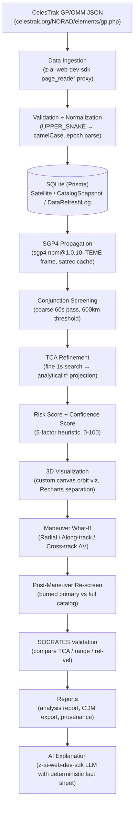

# SENTINEL — System Architecture

## High-Level Overview

SENTINEL is a single-process Next.js 16 application that combines a React frontend, an App Router API backend, a Prisma/SQLite persistence layer, and an in-process SGP4 propagation engine. All components live inside one codebase and one running process, which keeps deployment trivial and makes the full conjunction pipeline reproducible on a laptop.

The pipeline has twelve logical stages, each addressable by its own API endpoint, each leaving a provenance footprint in the database. Nothing happens silently — every conjunction, every snapshot, every refresh log, every analysis report is traceable back to a public CelesTrak fetch.

## Mermaid Diagram

## Stage-by-Stage Detail

### 1. CelesTrak GP/OMM JSON
The canonical public source for GP (General Perturbations) elements. SENTINEL fetches `https://celestrak.org/NORAD/elements/gp.php?GROUP=active&FORMAT=JSON` (and other groupings like `stations`, `starlink`, `cospar`) for each refresh. Because the sandbox cannot reach `celestrak.org` over HTTPS directly, all fetches are routed through the `z-ai-web-dev-sdk` `page_reader` proxy, with URL encoding of `?` and `&` as `%3F` and `%26` to preserve the query string.

### 2. Data Ingestion
The `src/lib/data/celestrak/client.ts` module wraps the SDK page_reader call, fetches the raw HTML response, and extracts the JSON payload from the `<pre>` wrapper CelesTrak emits.

### 3. Validation + Normalization
OMM fields arrive in `UPPER_SNAKE_CASE` (`OBJECT_NAME`, `MEAN_MOTION`, `ECCENTRICITY`). The `normalizeOmm` function maps these to camelCase Prisma fields, parses the `EPOCH` ISO string, validates the mean motion > 0, and computes a `rawHash` (SHA-256 of the canonical JSON) for change detection.

### 4. SQLite (Prisma)
Satellite records are upserted by `NORAD_CAT_ID`. A `CatalogSnapshot` row captures the run, and a `DataRefreshLog` records source, count, duration, and status. See `DATABASE.md`.

### 5. SGP4 Propagation
The `sgp4` npm package (v1.0.10) — a direct port of the python-sgp4 reference — is invoked via `sgp4init()` directly on the OMM fields, bypassing the TLE parser so that 6-digit catalog identifiers work correctly. State is returned in the TEME (True Equator Mean Equinox) frame. See `SGP4.md`.

### 6. Conjunction Screening
A coarse 60-second propagation sweep over the analysis window (default 7 days) for every primary candidate against every secondary, with a 600 km threshold and an altitude pre-filter. See `CONJUNCTION_DETECTION.md`.

### 7. TCA Refinement
Within each coarse minimum, a fine 1-second sweep localizes the local minimum. An analytical projection (`t* = t_fine - (r·v)/|v|²`) refines TCA to sub-second precision — necessary for high-relative-velocity encounters where the close-approach window is <100 ms. See `TCA_ALGORITHM.md`.

### 8. Risk + Confidence Scoring
A 5-factor heuristic risk score (0–100) and a separate confidence score (0–100) are computed and persisted on each Conjunction record. See `RISK_MODEL.md` and `CONFIDENCE_MODEL.md`.

### 9. 3D Visualization
A custom canvas orbit visualizer renders both satellites' propagated trajectories in TEME coordinates, with a separation-over-time chart rendered by Recharts. See `FRONTEND.md`.

### 10. Maneuver What-If
Hypothetical burns at 72/48/36/24/12/6 h before TCA, in Radial/Along-track/Cross-track directions. See `MANEUVER_SIMULATION.md`.

### 11. Post-Maneuver Re-screen
After a hypothetical burn, the maneuvered primary is re-screened against the original secondary *and* every other catalogued object — because avoiding one conjunction can create a new one. See `MANEUVER_SIMULATION.md`.

### 12. SOCRATES Validation
The same primary/secondary pair is looked up in CelesTrak SOCRATES and TCA/range/rel-vel are compared. SOCRATES is an independent public reference, not ground truth. See `SOCRATES_VALIDATION.md`.

### 13. Reports
Analysis reports aggregate the screening run: total objects, total conjunctions, distribution by risk level, top events, provenance. Export to PDF-friendly Markdown or CDM (CCSDS 508.0-B-1). See `CDM.md`.

### 14. AI Explanation
A deterministic fact sheet (primary name, secondary name, TCA, range, rel-vel, risk score, factor breakdown, covariance availability, disclaimer) is sent to the `z-ai-web-dev-sdk` LLM with a strict system prompt forbidding invented numbers, orbital mechanics calculations, or flight command authorization. See `AI_ASSISTANT.md`.

## Cross-Cutting Concerns

- **Caching**: 15-minute in-memory cache for `page_reader` responses plus persistent DB upsert on every refresh.
- **Error isolation**: A failure in one group's fetch does not abort the run; it is logged in `DataRefreshLog` and the rest of the catalog proceeds.
- **Provenance**: Every `Conjunction` row carries `snapshotId`, `analysisId`, `dataSource`, and `propagator`, so a conjunction can be traced back to the exact element set that produced it.
- **Demo data**: When live fetch fails (sandbox without HTTPS, offline mode), SENTINEL falls back to a bundled synthetic catalog so the UI is never blank. Demo-sourced conjunctions are explicitly badged `DEMO`.

## Reference

- CelesTrak GP/OMM API: https://celestrak.org/NORAD/elements/gp.php?GROUP=active&FORMAT=JSON
- CCSDS 508.0-B-1 (CDM): https://ccsds.org/searchpubs/
- sgp4 npm package: https://www.npmjs.com/package/sgp4
