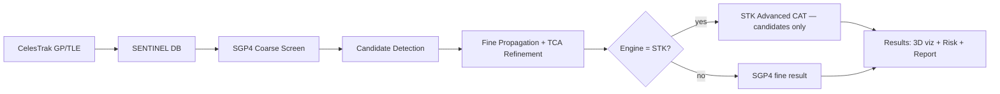

# Prediction Pipeline

This document traces the full path a single screening takes inside SENTINEL, from raw GP data to a risk-rated conjunction the operator can act on.

## End-to-End Flow

## Step 1 — TLE/GP data

CelesTrak publishes Two-Line Element sets (TLEs, modernized as GP messages) for every public catalog object. SENTINEL fetches these via the CelesTrak REST endpoints, normalizes them, and stores them in the local database along with a snapshot hash derived from the GP epoch. The ISS (NORAD 25544) is flagged as a protected asset; the screen runs against 22 real catalog objects including CYGNUS NG-24, PROGRESS-MS 34, SOYUZ-MS 29, and similar co-orbital traffic.

## Step 2 — SGP4 propagation

Each GP record is propagated with the `sgp4` npm package (v1.0.10) using the WGS-84 oblate-Earth model and the TEME (True Equator, Mean Equinox) reference frame. State vectors are emitted at the configured time step.

## Step 3 — State vectors → relative position → relative distance → TCA

For each (primary, secondary) pair the relative position is the vector difference of their TEME states. Its magnitude is the relative distance, sampled over the prediction window. The Time of Closest Approach (TCA) is the timestamp of the minimum of this curve, refined by parabolic interpolation around the coarse minimum so that the reported TCA is sub-second accurate even with a coarse step.

## Step 4 — Close approach

A close approach is reported whenever the minimum relative distance is below the screening threshold (e.g. 5 km). A close approach is **not** a collision. It is a flag that says "two trajectories intersect the threshold volume at some time"; whether that corresponds to a non-negligible probability of physical impact requires the covariance-based risk assessment of the next step.

## Step 5 — Risk assessment

SENTINEL computes a five-factor heuristic `riskScore` (distance 40%, uncertainty 20%, velocity 15%, geometry 15%, freshness 10%) for ranking and triage. The probability of collision (Pc) requires primary covariance, secondary covariance, combined hard-body radius, and encounter geometry on the b-plane. Public GP data carries no covariance, so Pc is rendered as `UNAVAILABLE` by default — see <https://www.nasa.gov/cara/step-2-close-approach-risk-assessment/>. Pc is never silently substituted with `riskScore / 100`.

## Hierarchical screening (coarse → fine → analytical refinement)

Propagating 12,000 objects at 1-second resolution over 7 days is intractable. SENTINEL screens hierarchically: cheap catalog and altitude filters reduce 12,000 objects to ~1,000 candidates, a coarse SGP4 sweep at 60–300 s reduces those to ~50 candidates, fine propagation at 1–10 s finds the actual conjunctions, and parabolic TCA refinement polishes each minimum. The expensive numerical propagator is never engaged against the whole catalog.

## STK integration

When the engine is `STK`, AGI/Ansys Systems Tool Kit (STK) Advanced CAT is invoked **only for the handful of candidates** that survived the SGP4 sweep — typically fewer than ten. STK performs high-fidelity numerical propagation, b-plane geometry, and (when covariance is supplied) the standard Pc estimators. If STK is unavailable, the STK column is rendered as `null` — **not** as a duplicate of the SENTINEL result. This is critical for scientific honesty: an empty STK cell is an honest "we could not independently verify this", whereas copying the SGP4 value would fabricate agreement that was never measured.
